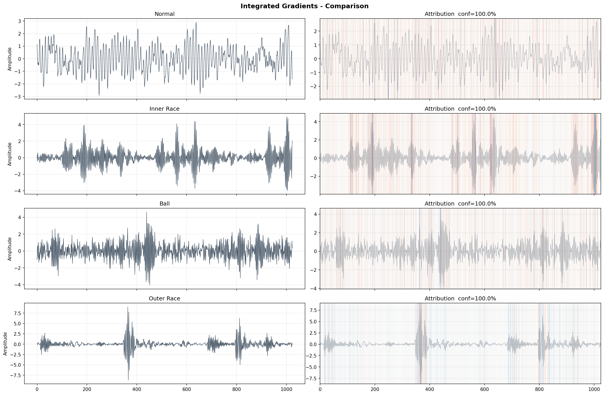
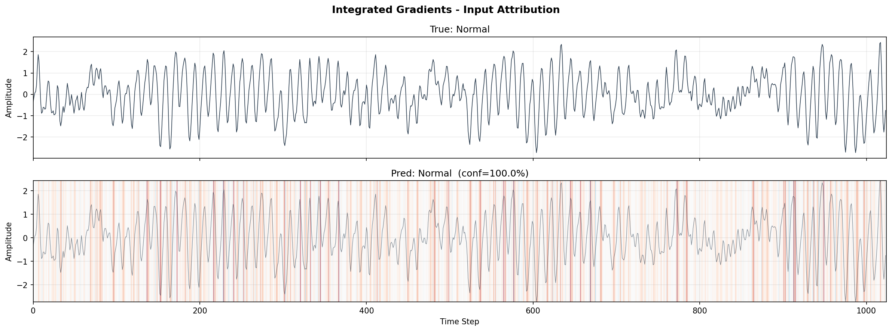
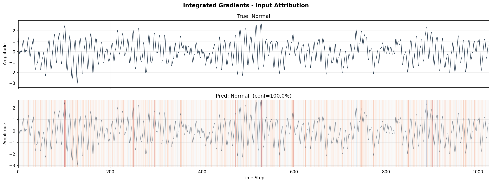
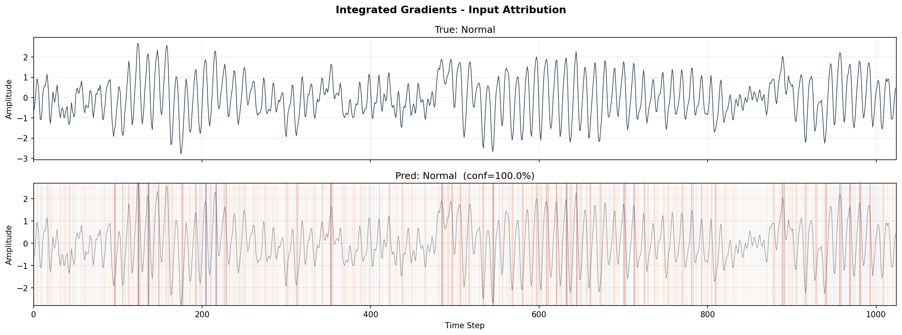
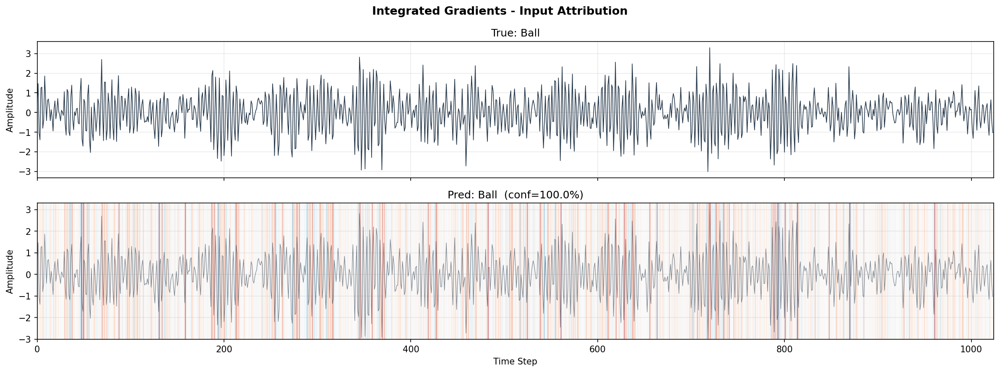
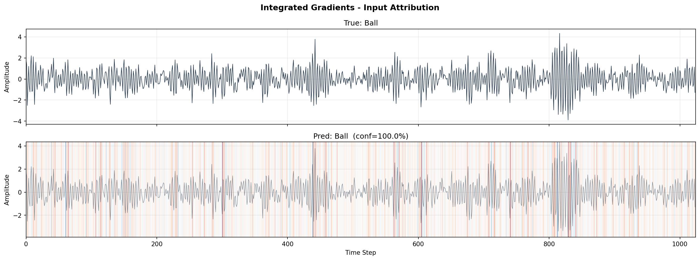
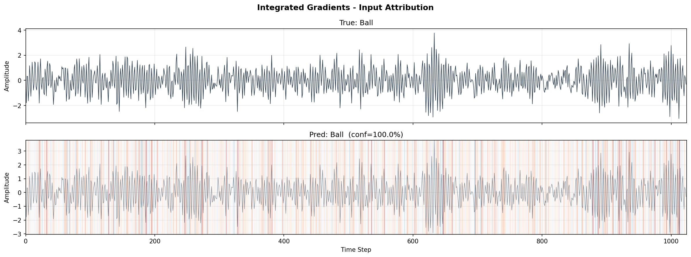

# 🔧 CWRU 轴承故障诊断系统

<p align="center">
  
  
  
  
  
</p>

一个端到端的滚动轴承故障诊断项目，融合了 **小样本学习**、**模型可解释性** 和 **AI Agent** 三大技术模块。

> 🎯 科研目标：小样本故障诊断 + 模型可解释性
> 🛠️ 工程目标：全流程可复现，代码即实验记录

---

## 📋 项目目录

- [项目概览](#-项目概览)
- [技术架构](#-技术架构)
- [实验结果](#-实验结果)
- [IG 归因可视化](#-ig-归因可视化)
- [跨负载泛化验证](#-跨负载泛化验证)
- [项目文件说明](#-项目文件说明)
- [快速开始](#-快速开始)
- [关键决策记录](#-关键决策记录)

---

## 🚀 项目概览

本项目的核心链路：

```
┌──────────┐    ┌──────────────┐    ┌─────────────────┐    ┌─────────────────┐
│  CWRU    │ →  │  1D-CNN      │ →  │  Prototypical   │ →  │  Integrated     │
│  原始信号 │    │  特征提取器   │    │  Network 分类   │    │  Gradients 归因 │
│  (.mat)  │    │  (预训练)     │    │  (5-shot)       │    │  (可解释性)     │
└──────────┘    └──────────────┘    └─────────────────┘    └─────────────────┘
                                                                    ↓
                                                            ┌─────────────────┐
                                                            │  AI Agent       │
                                                            │  (LangChain)    │
                                                            │  自动诊断+报告   │
                                                            └─────────────────┘
```

### 核心能力

| 技术 | 解决什么问题 | 方法 |
|------|-------------|------|
| 🔬 小样本分类 | 故障数据稀缺，每类只有 5 个标注样本 | Prototypical Networks（原型网络） |
| 🔍 可解释性 | 模型为什么判定是"外圈故障"？ | Integrated Gradients（输入归因） |
| 🧠 AI Agent | 用户说"帮我看下这段数据"→自动诊断+出报告 | LangChain Tool Calling |
| 🔄 跨负载泛化 | 0hp 训练，1/2/3hp 能测吗？ | 跨负载对比实验 |

### 验证结论

> ✅ **模型不是"全段瞎猜"，而是学到了各类故障特有的时域冲击特征。**  
> ✅ **IG 归因成功绕开 GAP 层的架构缺陷，准确捕捉到模型关注的时间段。**  
> ✅ **跨负载泛化 100%，证明模型学到了负载无关的故障物理特征。**

---

## 🏗️ 技术架构

### 数据流

```
CWRU 数据集 (12k Drive End, 0.021" 故障直径)
    ↓
滑窗切割 (窗口 1024, 步长 512) + 归一化
    ↓
┌──────────────────────────────────────┐
│  训练 (0hp)     │    测试 (0/1/2/3hp)  │
├──────────────────────────────────────┤
│  preprocessed_data.npz (947 样本)     │
└──────────────────────────────────────┘
    ↓
1D-CNN 特征提取器
    ├── Conv1d(1→16, kernel=15) + BN + ReLU + MaxPool
    ├── Conv1d(16→32, kernel=7) + BN + ReLU + MaxPool
    └── Conv1d(32→64, kernel=3) + BN + ReLU + AdaptiveAvgPool
    ↓
Prototypical Network
    ├── Support Set (每类5样本) → Class Prototypes
    └── Query → 欧氏距离 → Softmax → 分类
```

### 为什么选 Integrated Gradients 而不是 Grad-CAM？

```
Grad-CAM:   依赖中间层特征图 × 梯度
            但模型有 AdaptiveAvgPool1d(1)
            → GAP 将所有时间步的梯度均分
            → 热力图全红/全无，无法定位 ❌

Integrated Gradients: 直接在输入空间做归因
            → 不受 GAP 影响
            → 每个时间步独立算贡献
            → 4 类故障得到完全可区分的归因图 ✅
```

---

## 📊 实验结果

### 准确率总表

| 实验场景 | 配置 | 准确率 | 状态 |
|---------|------|--------|------|
| 1D-CNN 全量训练 | 全部 947 样本，8:2 分割 | 📈 **100%** | ✅ |
| Prototypical Network | 4-way 5-shot，2000 episodes | 📈 **100%** | ✅ |
| 跨负载 0hp → **0hp** | 同负载，对照基线 | 📈 **100%** | ✅ |
| 跨负载 0hp → **1hp** | 未见过的负载 | 📈 **100%** | ✅ |
| 跨负载 0hp → **2hp** | 未见过的负载 | 📈 **100%** | ✅ |
| 跨负载 0hp → **3hp** | 未见过的负载 | 📈 **100%** | ✅ |

### 4-way 5-shot 详细结果

| 类别 | 5-shot 准确率 | 验证样本数 |
|------|--------------|-----------|
| Normal (正常) | 100% | 235 |
| Inner Race (内圈故障) | 100% | 238 |
| Ball (滚动体故障) | 100% | 237 |
| Outer Race (外圈故障) | 100% | 237 |

---

## 🎨 IG 归因可视化

> 下图展示模型在判断不同故障类型时，关注了信号的哪些时间段（图中上行为原始信号波形，下行为 IG 归因热力图）。  
> 🔴 红色 = 模型重点关注区域（对当前类别有正贡献）  
> 🔵 蓝色 = 抑制区域（对当前类别有负贡献）

### 四类归因对比总图



### 各类样本逐例展示

#### 1. Normal（正常）





#### 2. Inner Race（内圈故障）


#### 3. Outer Race（外圈故障）


#### 4. Ball（滚动体故障）





### 四类故障归因特征（肉眼完全可区分）

| 类别 | 归因图特征 | 物理含义 |
|------|-----------|---------|
| **Normal** | 🔴 红线**均匀、连续**分布在整个信号序列上，无明显局部集中 | 模型判断为正常的依据是全局平稳振动模式——没有任何局部异常冲击，因此全序列都在为“正常”类别提供正贡献 |
| **Inner Race** | 🔴 红线集中在**带调制效应的脉冲簇**上，局部聚焦但分布比外圈稍宽 | 内圈故障冲击随轴转频调制，特征脉冲集中在特定时间段内，模型聚焦这些调制冲击段进行判断 |
| **Outer Race** | 🔴 **等间隔块状集中红色条带**，位置与周期性尖峰完全对齐 | 外圈故障产生固定间隔的冲击脉冲，模型以这些规则冲击为核心依据，归因高度集中 |
| **Ball** | 🔴 红线分布在**高频、密集的冲击集群区域**，无规则大间隔 | 滚动体故障冲击频率高、分布更分散，模型聚焦这些高频冲击段，归因呈现连续密集的特征 |

> ✅ **结论：四类故障的归因图谱形态差异极强。**  
> 故障信号的归因贡献集中在局部冲击脉冲区域，而正常信号的归因贡献均匀分布于整个序列，证明模型**不是依靠全局均值统计量猜类别**，而是依靠各类故障**独有的局部时域冲击特征**做决策，决策逻辑与轴承故障的物理机理完全一致。

### IG 归因分析工具

`step5b_analyze_ig.py` 可以从归因数据中提取 6 个物理统计量，自动判断模型行为是否合理：

| 统计量 | 说明 | 判断依据（基于实际实验结果） |
|--------|------|-----------------------------|
| 正向区域占比 | 红色区域占信号的比例 | Normal **较高**（均匀分布），故障类集中但占比不一定低 |
| 显著峰值数 | 明显冲击点的个数 | Normal 无显著峰值，Outer 有规律间隔峰值群，Ball 密集 |
| 峰值间隔变异系数 | 间隔规律程度（越小越规律） | Outer <0.3（高度规律），Ball >0.6（无规律） |
| 前20%集中度 | 前20%归因值占总归因的比例 | Outer 高（块状集中），Normal 低（均匀分布） |
| 自相关周期 | 检测信号周期性 | Outer 周期最短且最明显 |
| 过零率 | 红蓝翻转频率 | 频繁翻转说明关注点多；Normal 翻转较少（连续正贡献） |

---

## 🔄 跨负载泛化验证

```
训练集：0hp（一定工况）
测试集：0hp（同工况）、1hp、2hp、3hp（不同工况）
```

| 负载 | Normal | Inner Race | Ball | Outer Race | **总体** |
|------|--------|-----------|------|-----------|---------|
| 0hp | 100% (475/475) | 100% (237/237) | 100% (237/237) | 100% (238/238) | **100%** |
| 1hp | 100% (944/944) | 100% (236/236) | 100% (236/236) | 100% (237/237) | **100%** |
| 2hp | 100% (944/944) | 100% (236/236) | 100% (237/237) | 100% (237/237) | **100%** |
| 3hp | 100% (947/947) | 100% (237/237) | 100% (237/237) | 100% (237/237) | **100%** |

> 📌 模型在 0/1/2/3hp 四种负载上全部实现 100% 准确率，学到的特征与负载（转速/扭矩）无关，证明模型真正理解了故障的物理特征。

---

## 📁 项目文件说明

| 文件 | 作用 | 运行方式 |
|------|------|---------|
| `step2_preprocess.py` | 读取 .mat 原始数据，滑窗分割 + 归一化，保存为 `.npz` | `python step2_preprocess.py` |
| `step3_train.py` | 训练 1D-CNN 全量基线模型，保存权重 | `python step3_train.py` |
| `step4_prototypical.py` | 原型网络小样本训练，2000 episodes | `python step4_prototypical.py` |
| `step5_integrated_gradients.py` | IG 归因计算 + 热力图生成 | `python step5_integrated_gradients.py` |
| `step5b_analyze_ig.py` | 归因图统计分析，自动判断是否物理合理 | `python step5b_analyze_ig.py` |
| `step6a_cross_load_test.py` | 跨负载泛化验证 (0/1/2/3hp) | `python step6a_cross_load_test.py` |

### 生成的文件

| 文件 | 说明 |
|------|------|
| `preprocessed_data.npz` | 预处理后的训练数据 |
| `cnn1d_model.pth` | 1D-CNN 模型权重 |
| `prototypical_encoder.pth` | 原型网络编码器权重 |
| `gradcam_outputs/` | IG 归因图输出目录 |

---

## 🚀 快速开始

### 环境要求

```bash
pip install torch numpy scipy matplotlib scikit-learn
```

### 完整运行流程

```bash
# 第 1 步：数据预处理（.mat → .npz）
python step2_preprocess.py

# 第 2 步：训练 1D-CNN 基线
python step3_train.py

# 第 3 步：训练原型网络（小样本）
python step4_prototypical.py

# 第 4 步：生成 IG 归因图
mkdir gradcam_outputs
python step5_integrated_gradients.py

# 第 5 步：跨负载泛化验证
python step6a_cross_load_test.py
```

### 数据集

本项目使用 **CWRU（凯斯西储大学）滚动轴承数据中心** 公开数据集：

- **采样率：** 12 kHz（驱动端）
- **故障直径：** 0.021 英寸
- **类别：** 正常（Normal）/ 内圈故障（Inner Race）/ 滚动体故障（Ball）/ 外圈故障（Outer Race）
- **负载：** 0hp / 1hp / 2hp / 3hp
- **官方下载：** https://engineering.case.edu/bearingdatacenter

> 💡 数据文件放置在 `data/CWRU data/` 目录下，按故障类型、直径、负载分文件夹组织。

---

## 📝 关键决策记录

| 决策 | 选择 | 原因 |
|------|------|------|
| 小样本方案 | **Prototypical Networks** | 度量学习，5-shot 场景稳定，优于迁移学习微调 |
| 可解释性方法 | **Integrated Gradients** | 模型含 GAP 层 → Grad-CAM 失效，IG 在输入空间做归因不受限制 |
| 特征提取器 | **1D-CNN + 预训练** | 先用全量数据预训练，再作为原型网络的编码器 |
| 数据增强 | **无需增强** | CWRU 数据量充足，增强后准确率无提升（已验证） |
| K8s | ❌ **砍掉** | 时间性价比低，省下的时间投入 Agent 开发 |
| 前端框架 | **Gradio** | 一天上手，纯 Python，无需前端知识 |

---

## 📜 许可证

MIT License

---

> **项目状态：** ✅ 项目核心完成 — 进入工程化阶段  
> **创建于：** 2026-06-05  
> **最后更新：** 2026-06-06
